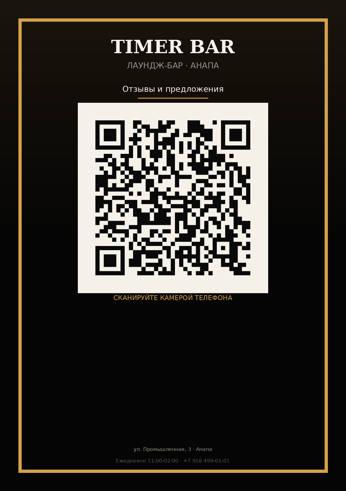

# Timer Bar — Электронная книга отзывов

Веб-страница «Книга отзывов и предложений» для гостей **Timer Bar**
(Анапа, ул. Промышленная, 3). Гость сканирует QR → оставляет обращение →
сообщение мгновенно приходит владельцу в Telegram / на Email / в Google
Sheets (на выбор).

## Демо

Страница: одна форма на тёмном фоне с золотым акцентом, адаптивная
(мобильный / планшет / десктоп).



## Структура проекта

```
timerbar-feedback/
├── index.html              ← страница с формой
├── style.css               ← стили (тёмная тема + золотой)
├── script.js               ← валидация + отправка
├── config.example.json     ← шаблон конфигурации (без секретов)
├── functions/
│   └── api/
│       └── feedback.js     ← Cloudflare Pages Function
├── assets/
│   └── logo.png            ← логотип Timer Bar
├── qr/
│   ├── qr.png              ← QR для цифровых каналов
│   ├── qr-styled.png       ← стилизованный (золотой)
│   ├── qr.svg              ← векторный
│   ├── qr-path.svg         ← минималистичный path-SVG
│   ├── print-A5.png        ← макет для печати A5 (148×210 мм)
│   ├── print-A5.svg        ← макет A5 в SVG
│   ├── print-A6.png        ← макет для печати A6 (105×148 мм)
│   └── print-A6.svg        ← макет A6 в SVG
└── README.md
```

## Быстрый старт

### Локальный запуск (без backend)

```bash
# 1. Скачайте файлы
git clone https://github.com/Semikden/timerbar-feedback.git
cd timerbar-feedback

# 2. Откройте index.html в браузере
open index.html  # macOS
xdg-open index.html  # Linux
start index.html  # Windows
```

Без настроенного `endpoint` форма покажет пользователю почтовый клиент
с заполненным письмом (`mailto:` fallback). Это работает «из коробки».

### Прод-деплой через Cloudflare Pages

```bash
# Установить wrangler
npm i -g wrangler
wrangler login

# Деплой
wrangler pages deploy . --project-name=timerbar-feedback

# В Dashboard → Pages → timerbar-feedback → Settings → Variables:
#   CHANNEL=telegram
#   TELEGRAM_BOT_TOKEN=...
#   TELEGRAM_CHAT_ID=...
```

## Подключение каналов

### 1. Telegram (рекомендуется — мгновенные пуши)

1. В Telegram → `@BotFather` → `/newbot` → получите `TELEGRAM_BOT_TOKEN`
2. Узнайте свой `TELEGRAM_CHAT_ID`:
   - Напишите боту любое сообщение
   - Откройте `https://api.telegram.org/bot<TOKEN>/getUpdates`
   - Найдите `chat.id` в JSON
3. В Cloudflare Pages → Settings → Variables:
   ```
   CHANNEL=telegram
   TELEGRAM_BOT_TOKEN=123456:ABC-DEF...
   TELEGRAM_CHAT_ID=987654321
   ```

После отправки формы владелец получит в Telegram:

```
🆕 Новое обращение Timer Bar
Тип: Жалоба
Имя: Иван
Контакт: +7 999 000-00-00
Когда: 14.09.2026, 19:43

Официант не принёс счёт 15 минут...
```

### 2. Email (через Resend)

1. Зарегистрируйтесь на [resend.com](https://resend.com)
2. Получите API Key
3. В Variables:
   ```
   CHANNEL=email
   RESEND_API_KEY=re_...
   EMAIL_FROM=Timer Bar Feedback <noreply@timerbar.ru>
   EMAIL_TO=owner@timerbar.ru
   ```

### 3. Google Sheets (требует настройки)

Google Sheets сложнее — нужен Service Account. См.
[Deployment.md в Obsidian](../10%20Projects%20(Проекты)/TimerBar-Electronic-Feedback/Deployment.md).

Краткий путь:
1. Google Cloud Console → IAM & Admin → Service Accounts → Create
2. Дайте роль `Editor` (или создайте custom role с правами Sheets API)
3. Создайте JSON-ключ
4. Скопируйте содержимое JSON в `GOOGLE_CREDENTIALS_JSON`
5. Создайте таблицу, расшарьте на email сервис-аккаунта
6. Variables:
   ```
   CHANNEL=sheets
   GOOGLE_CREDENTIALS_JSON={"type":"service_account",...}
   SHEET_ID=1abc...
   SHEET_NAME=Feedback
   ```

### 4. Webhook (n8n / Make / Zapier / Slack / Discord)

```bash
CHANNEL=webhook
WEBHOOK_URL=https://your-n8n.com/webhook/...
```

Function проксирует весь payload как POST JSON на ваш URL.

## Как заменить логотип

Замените `assets/logo.png` на свой файл (PNG/JPG, рекомендую квадрат,
≥ 300×300). Сохраните имя файла — `index.html` ссылается именно на
`assets/logo.png`. Если нужно другое имя/путь — поправьте строку:

```html

```

## Как поменять цвета

Все цвета живут в начале `style.css` в блоке `:root`:

```css
:root {
  --bg: #0A0A0A;        /* основной фон */
  --bg-card: #161616;   /* фон карточек */
  --bg-input: #1F1F1F;  /* фон полей ввода */
  --accent: #D4A24C;    /* золотой акцент */
  --text: #F5F1E8;      /* основной текст */
  /* ... */
}
```

Поменяйте значения — и весь интерфейс перекрасится. После замены
перегенерируйте QR-макеты (см. ниже) для соответствия новым цветам.

## Перегенерация QR-кода

QR хранится в `qr/` в нескольких форматах. Если изменился URL или
дизайн — перегенерируйте:

```bash
# Нужен Python 3 + qrcode + Pillow
pip install "qrcode[pil]"

# Запуск генератора (скрипт в Obsidian: /root/Obsidian/...)
# Или используйте любой онлайн-генератор + замените файлы
```

После перегенерации:
- `qr/qr.png` — основной QR для экрана
- `qr/print-A5.png`, `qr/print-A6.png` — макеты для типографии
- `qr/print-A5.svg`, `qr/print-A6.svg` — векторные для любого размера

**Текущий URL в QR:** `https://timerbar-feedback.pages.dev` (замените
после настройки custom domain).

## Чек-лист запуска в заведении

- [ ] Залить код на GitHub (уже сделано)
- [ ] Задеплоить на Cloudflare Pages
- [ ] Настроить Variables (Telegram / Email / Webhook)
- [ ] Протестировать форму (отправить тестовое обращение)
- [ ] Распечатать макет A5 или A6 на плотной бумаге
- [ ] Поставить наклейку на входе / на столах / на чеках
- [ ] Убедиться что QR сканируется с расстояния 30–50 см
- [ ] Опционально: добавить на сайт timerbar.ru ссылку на страницу

## Документация для владельца

Полная документация проекта (включая research, design-specs,
deployment) лежит в Obsidian:
`Projects → TimerBar-Electronic-Feedback/`.

## Лицензия

Проект сделан для Timer Bar (Анапа). Свободное использование при
сохранении атрибуции.

---

**Контакты для связи:** GitHub Issues в этом репозитории.
**Логотип:** скачан с Яндекс Карт (ID `7379963`).
**Автор:** Gera (Hermes Agent) — автономная разработка по заказу Дениса Semikden.